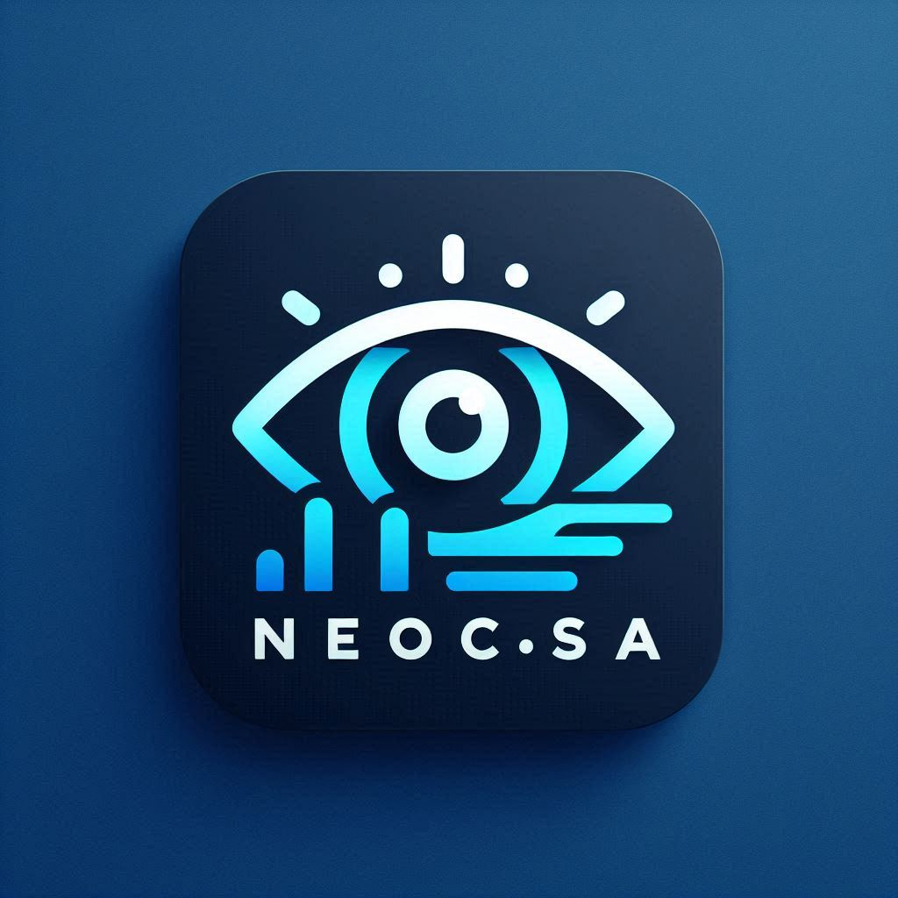

# Neocasa

Neocasa is an app that uses state of the art AI models to get the descriptions of our images, with the following features.
* Generate image descriptions and allow you to ask follow-up questions.
* Allows you to communicate using speech, and here an audio feedback if you want to.
* Generate brief captions for images, suitable for the web.
* Take a screenshot to describe it.
* Describe any window, app, or whatever can be snapped. Including yourself using your device camera!

Just like Microsoft has seeingAI for Android and IOS, consider this as a seeingAI for windows, but using several AI models.

The following models are currently supported, or will be in the coming months.
* Microsoft Azure
* Google Gemini
* OpenAI
* Claud
* Grok

## Requirements and how to run the project locally:
Please note: requirements for each models will be added as they are built.
### Microsoft Azure
* Firstly, you will need access to the [Azure portal](https://portal.azure.com).
* You can follow [this article ](https://azure.microsoft.com/free/) to create a free account, or even [create an azure for student account](https://azure.microsoft.com/free/students) if you are a student. 
* Then, create a [speech](https://portal.azure.com/#create/Microsoft.CognitiveServicesSpeechServices) and [vision](https://portal.vision.cognitive.azure.com/) resource. For an instruction on how to create an azure resource, [click here.](https://learn.microsoft.com/en-us/azure/developer/intro/azure-developer-create-resources). You should be fine after that.
* Get your keys and endpoint.

* Clone this repo to your local machine:
  ```
  https://github.com/kefaslungu/neocasa.git
  ```
* And then I'll suggest you create a virtual environment to store all the dependences for this project.
  ```
  pip install -r requirements.txt
  ```
* You don't need me to tell you that you need python install right? Well at list version 3.8 is required, but version 3.10 is recommended!

## Building an executable (*.exe):
* Clone the project (see above on how to do so), run:
  ```
  cd neocasa
  ```
* Make sure you are running in a virtual environment. In your terminal, run this:
  ```
  python -m venv neocasa
  .\neocasa\scripts\activate.bat
  pip install -r requirements.txt
  ```
* Wait for the process to complete, and run:
  ```
  python -m setup.py build
  ```


If you don't want to go through the stress of installing python and the stress of creating a virtual environment or even installing dependences, don't worry. I'll release binaries just for you!

But, you still need to get your keys and endpoint. Just follow the instruction of the app to insert those things if you are using the binaries.
